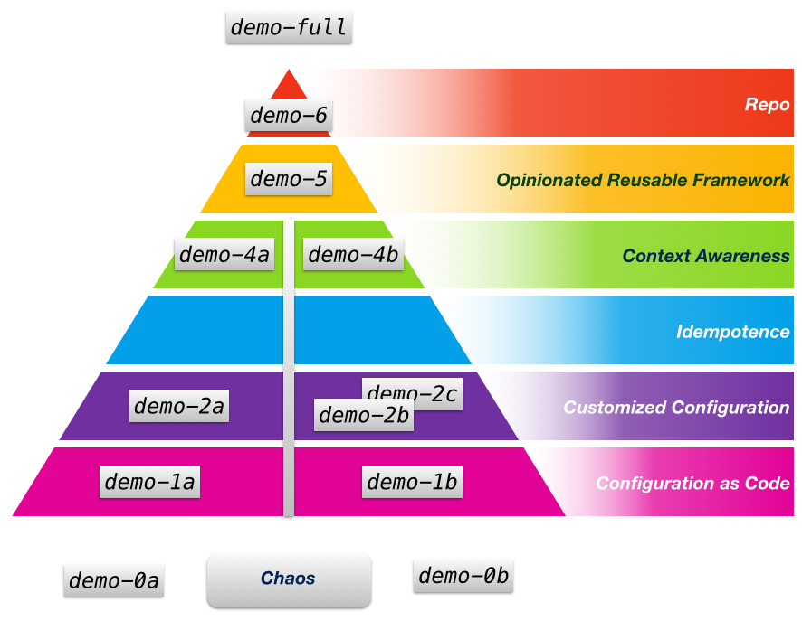

A Gentle Introduction to Ansible
===


## Background

Companion lab materials for my talk given at [Modern Web 2015, Taipei](http://modernweb.tw/) (2015-05-16) by William Yeh.

Forty minutes presentation, with some live demos on Vagrant and IaaS instances (e.g., EC2, Google Compute Engine).


## Topic

A gentle introduction to [Ansible](https://github.com/ansible/ansible), using a set of working examples: Nginx, Node.js, and React.

Ansible positions itself as an “IT automation system”, but only the “*configuration management*” subset is discussed here.

## Videos

View online: https://youtu.be/FboNN3OSq60


## Slides

View online: http://bit.ly/ansible-slide

Due to time constaints (40 minutes), not all details are explained in the talk and slides.  If more details needs to be explained, together with all labs demonstrated, 2 hours may be more appropriated.


## Lab materials

The following figure illustrates the mapping between each `demo-*` directory and associated topic in the slides:




## Preparation

Before experiment with the lab material, complete the following environment setup:

1. Install VM software:

   - Install [Vagrant](http://www.vagrantup.com/downloads.html), an excellent programmable VM environment.
   - Install [VirtualBox](https://www.virtualbox.org/wiki/Downloads), or purchase more powerful VM software such as [VMware Workstation](http://www.vmware.com/tw/products/workstation/), [VMware Fusion](http://www.vmware.com/tw/products/fusion), and [Parallels Desktop](http://www.parallels.com/products/desktop/).

   Or, read the article "[Playing VMs with Vagrant](http://www.codedata.com.tw/social-coding/vagrant-tutorial-2-playing-vm-with-vagrant/)" (in Traditional Chinese) for more information.


2. Install [Ansible](https://github.com/ansible/ansible) client:

   ... using Homebrew mechanism (on Mac):

     ```bash
     brew install ansible
     ```

   or, using Pip (on Linux or Mac) since Ansible was written in Python:

     ```bash
     pip install ansible
     ```

3. Done!


## License

Author: William Yeh, william.pjyeh@gmail.com

Apache License V2.
